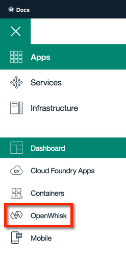
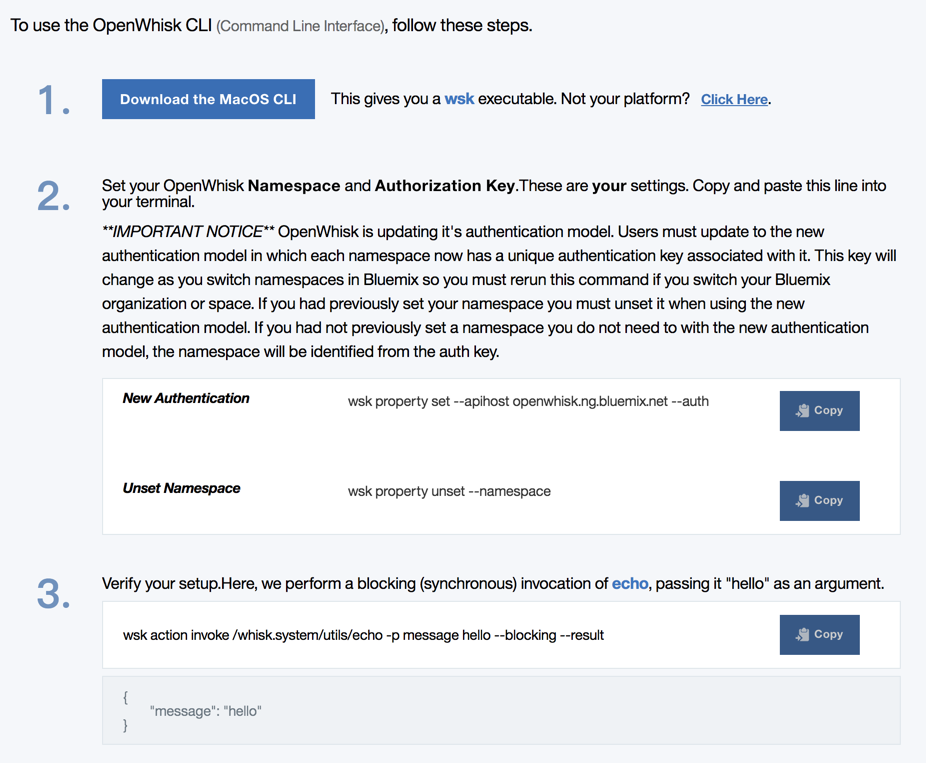

# Getting Started with OpenWhisk and Serverless APIs
This project provides sample code for creating your serverless REST APIs with Apache OpenWhisk on IBM Bluemix. It should take no more than 10 minutes to get up and running. Once you complete this sample application, you can move on to more complex serverless application use cases.

# Overview of HTTP REST API definition
To come.

## Flow of create, read, update, delete calls
1. The developer invokes the PUT API endpoint to create a cat entity with a name, gender, and description.
2. The developer invokes the GET API endpoint to retrieve the new cat data.
3. The developer invokes the PUT API endpoint to update the cat data.
4. The developer invokes the DELETE API endpoint to delete the cat data.

# Installation
Setting up this sample involves configuration of OpenWhisk and Cloudant or PostgreSQL on IBM Bluemix. Let’s briefly review each of them.

## Sign up for a Bluemix account
Begin by going to [bluemix.net](https://console.ng.bluemix.net/) and signing up for a free account. After you activate your account, set an organization (for example, *MyACMEorg*) and space (for example *test*), click on OpenWhisk in the left navigation.


## Install, configure, and test the OpenWhisk CLI
Once there, click the "Download OpenWhisk CLI" button.


Then, follow the three steps to install, configure, and test connectivity. Note that the authorization key is not shown here.


### Set up Cloudant

Log into the Bluemix console and create a Cloudant instance and name it `cats-db`. You can reuse an existing instance if you already have one. Update `CLOUDANT_INSTANCE` in `local.env` to reflect the name of the Cloudant service instance.

Then set the `CLOUDANT_USERNAME` and `CLOUDANT_PASSWORD` values in `local.env` based on the service credentials for the service.

Log into the Cloudant console and create a database. Set the database name in the `CLOUDANT_DATABASE` variable.


## Execute `deploy` to deploy the sample
Clone this repository to your system, and change to the root directory and install the app using `deploy.sh`

This will be adjusted soon to use ['wskdeploy'](https://github.com/openwhisk/openwhisk-wskdeploy) tool, which uses a manifest to create the triggers, actions, and rules that power the sample.

```bash
./deploy.sh --install
```

## Confirm that everything works

Use the `postCat.sh`, `getCat.sh`, `putCat.sh`, `deleteCat.sh` helper scripts to create, get, update and delete cats respectively. But first, set the `CAT_API_URL` environment variable to the endpoint matching the cat api url from `wsk api-exerimental list` command.
```bash
export CAT_API_URL=[url]
```

## Troubleshooting

The first place to check for errors is the OpenWhisk activation log. You can view it by tailing the log on the command line with `wsk activation poll` or you can view the [monitoring console on Bluemix](https://console.ng.bluemix.net/openwhisk/dashboard).

# Credits

To come.

# License

Licensed under the [Apache 2.0 license](LICENSE.txt).
